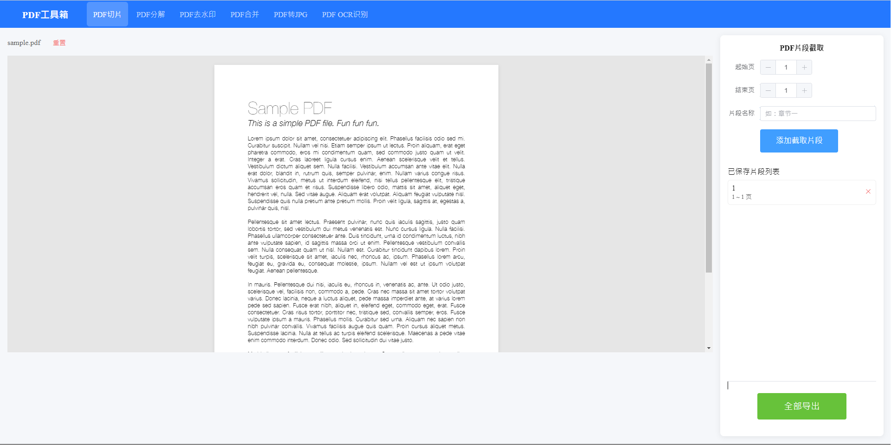
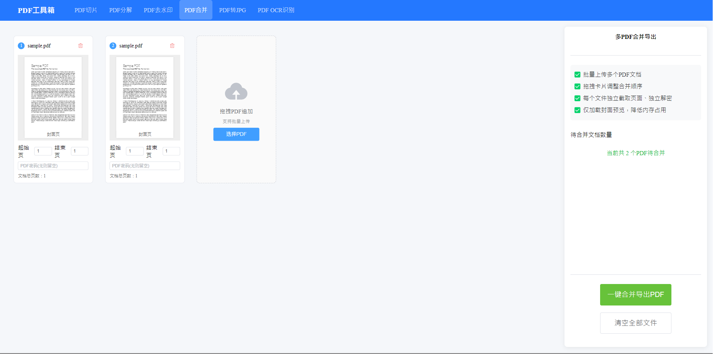
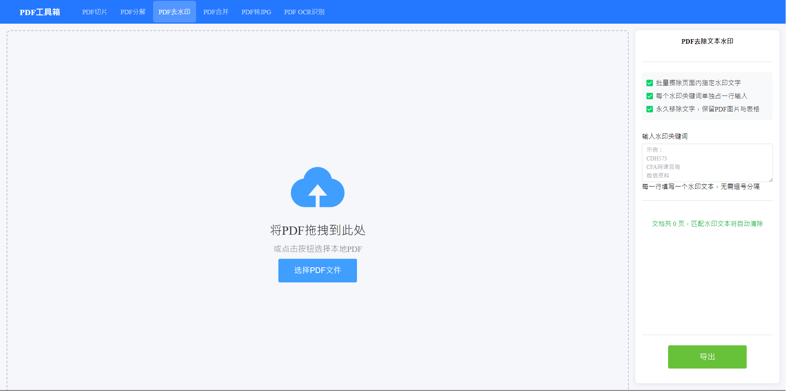
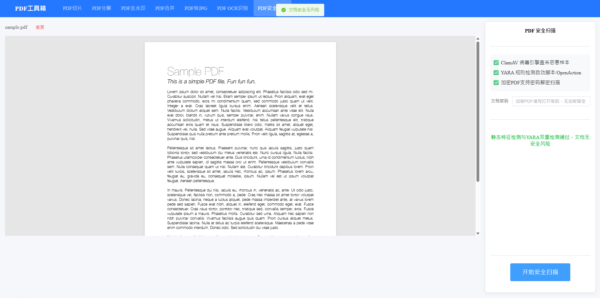

# PdfMaster
An Full-Stack Office Document Processor (In-progress)

# Current Progress

## Functions:
PDF pages splitting 

PDF merging 

PDF to image (.jpg or .png) 

PDF watermark removal: able to remove text base watermark 

*PDF security scan

# Future plan
PDF OCR scanning to .txt 

Watermark Removal Based on Solid Color Images 

Table Context Subtraction 

AI reading 

Supporting above functions for .docx files 

# Project Structure
Front end: Vue3 with Javascript (/src) 
Back end: Python3 with Django
